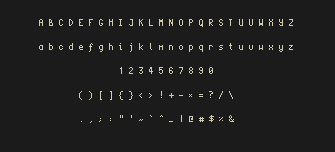
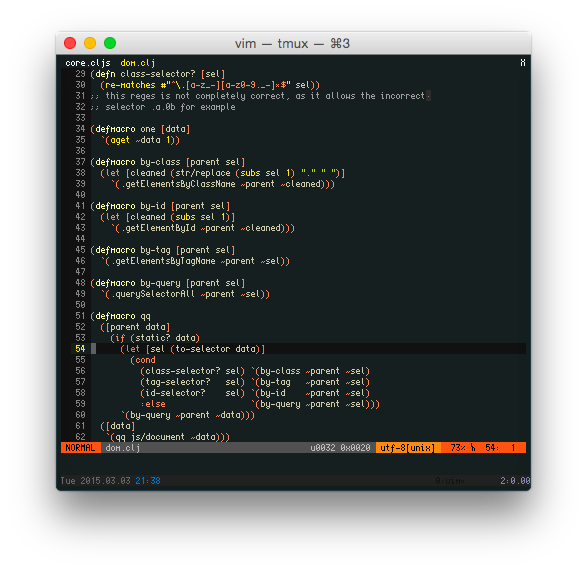
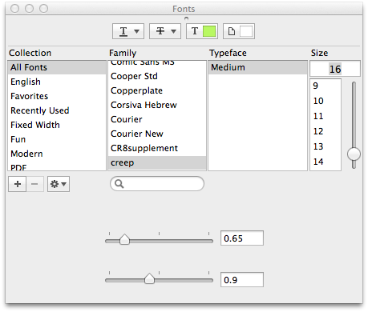

creep
=====

I never found the pixel font that was perfect for me, so I decided to roll
my own with creep.  It is a pretty compact (only 4px wide!) font that's great
for smaller screens (like my 11" laptop).

I'm constantly adding in new characters (diacritics, box-drawing characters, etc.),
so I figured I'd put it up on github for poeple to reap the gain this.




## Usage
The font is maintained using the awesome [gbdfed](http://sofia.nmsu.edu/~mleisher/Software/gbdfed/) 
which unfortunatly does not support a lot of export formats besides `bdf`.

To install creep in Mac OS X, you can use [font forge](http://fontforge.org/) to convert the `bdf`
file to a `dfont` file that can be used by Font Book.app to install the font.  To do this:

1. open the font in font forge:

   ```shell
   $ fontforge creep.bsd
   ```
2. select `File > Generate Fonts`
3. from the left dropdown select `No Outline Font`
4. from the right dropdown select `Apple bitmap only sfnt (dfont)`
5. click `Save`
6. open the `.dfont` file in Font Book.app
7. You're done!

Alternativatly you can download one of the [releases](https://github.com/romeovs/creep/releases),
these are not the latest versions of the font but I will try to update them regulary so you don't
have to go trought these steps.

I'm not a professional font creator so there are some quirks in the character
sizing.  To get past these I set the line height to 0.85 and the character spacing
to 0.75 in Terminal.app (using a Size of 16px).



## Attribution
Before I created creep I was using Proggy Tiny, which is a great font
and has given me a lot of inspiration.

[CREEPIN NO SLEEPING](https://soundcloud.com/youngmustard/creepin-no-sleepin)

## License
I love you all, so please use this font as much as you like for free.  But make sure you provide the
same liberty in it's new incarnations.

