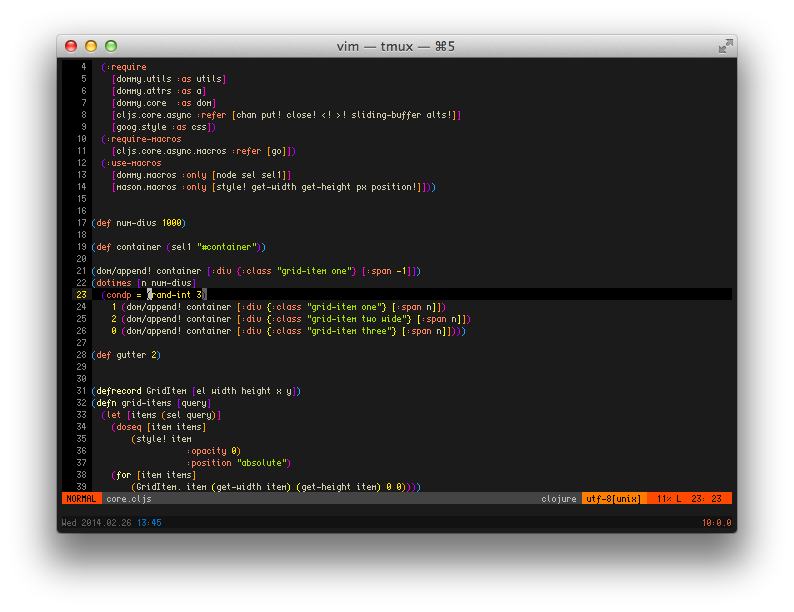

creep
=====

I never found the pixel font that was perfect for me, so I decided to roll
my own with creep.  It is a pretty compact (only 4px wide!) font that's great
for smaller screens (like my 11" laptop).

I'm constantly adding in new characters (diacritics, box-drawing characters, etc.),
so I figured I'd put it up on github for poeple to reap the gain this.




## Usage
The font is maintained using [gbdfed](http://sofia.nmsu.edu/~mleisher/Software/gbdfed/) which
unfortunatly does not support a lot of export formats besides `bdf`.

To install creep in Mac OS X, you can use [font forge](http://fontforge.org/) to convert the `bdf`
file to a `dfont` file that can be used by Font Book.app to install the font.  To do this:

1. open the font in font forge:
   ``` shell
   $ fontforge creep.bsd
   ```
2. select `File > Generator Fonts`
3. from the dropdown select `Apple bitmap only sfnt (dfont)`
4. click Save
5. open the dfont in Font Book.app
6. You're done!

## Attribution
Before I created creep I was using Proggy Tiny, which is a great font
and has given me a lot of inspiration.
