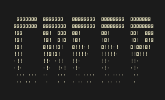
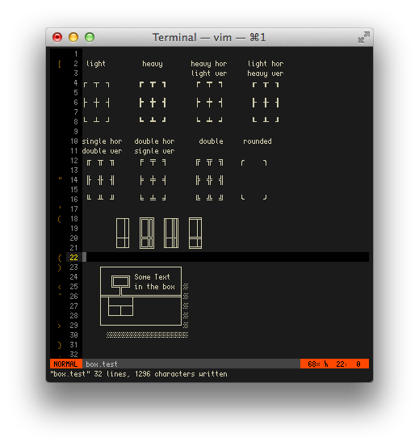
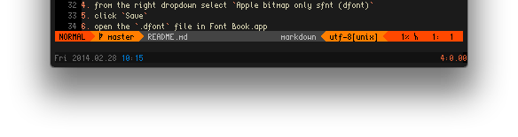
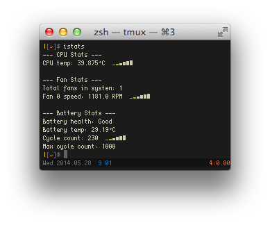
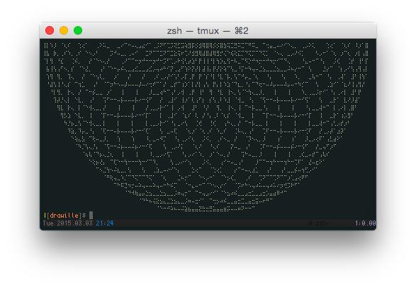

<hr/>

This repository is no longer being actively maintained (at least not
extensively). Have a look at some more up to date alternatives:
- [raymond-w-ko/creep2](https://github.com/raymond-w-ko/creep2)
- [slavfox/Cozette](https://github.com/slavfox/Cozette)
- [fcambus/spleen](https://github.com/fcambus/spleen)
- [pico](https://www.lexaloffle.com/bbs/?tid=3760)

[Features](#features) · [Installation](#installation) · [Attribution](#attribution) ·
[Licence](#license)

I never found the pixel font that was perfect for me, so I decided to roll
my own with creep.  It is a pretty compact (only 4px wide!) font that's great
for smaller screens (like my 11" laptop).

I'm constantly adding in new characters (diacritics, box-drawing characters, etc.),
so I figured I'd put it up on github for people to reap benefits of this.

I also recently added some nice [Haskell features](https://github.com/romeovs/creep/wiki/Haskell-syntax-sugar) (that
can be used in other languages too)!


### Features
[Box Drawing](#box-drawing) · [Sparklines](#sparklines) ·
[Haskell](#better-haskell-syntax) · [Braille and
Drawille](#braille-and-drawille)
#### Box drawing
Creep has most of the basic box drawing characters implemented.  Therefore creep
usually works with most ncurses-type programs or with tmux window-splitting for
example.



#### Powerline
Creep supports all the symbols needed for Lokaltog's awesome [powerline](https://github.com/Lokaltog/powerline) plugin
for vim:



#### Sparklines
Creep has the necessary symbols for creating sparklines. This is cool
for tools like [rainbarf](https://github.com/creaktive/rainbarf) and others.
I mean, see how good it makes [iStats](https://github.com/Chris911/iStats) look:



#### Better Haskell syntax
I've added support for a better-looking Haskell syntax.  Take a look at [the Haskell wiki
page](https://github.com/romeovs/creep/wiki/Haskell-syntax-sugar) to get an idea
of how it looks and how to use it in vim.

#### Braille and Drawille
Creep now supports the full
[braille alphabet](https://en.wikipedia.org/wiki/Braille_Patterns_(Unicode)),
which was an easy thing to do because of the clever braille encoding scheme.
All of the braille characters are simply generated using a little script.

Because creep supports braille, it also supports the wonderful
[Drawille](https://github.com/asciimoo/drawille) libraries:



## Installation
The font is maintained using the awesome [gbdfed](http://sofia.nmsu.edu/~mleisher/Software/gbdfed/) 
which unfortunatly does not support a lot of export formats besides `bdf`.

To install creep in Mac OS X, you can use [font forge](http://fontforge.org/) to convert the `bdf`
file to a `dfont` file that can be used by Font Book.app to install the font.  To do this:

1. open the font in font forge:

   ```shell
   $ fontforge creep.bdf
   ```
2. select `File > Generate Fonts`
3. from the left dropdown select `No Outline Font`
4. from the right dropdown select `Apple bitmap only sfnt (dfont)`
5. click `Save`
6. open the `.dfont` file in Font Book.app
7. You're done!

Alternativatly you can download one of the [releases](https://github.com/romeovs/creep/releases),
these are not the latest versions of the font but I will try to update them regulary so you don't
have to go trought these steps.

I'm not a professional font creator so there are some little quirks in the character
sizing.  To get past these I set the line height to 0.9 and the character spacing
to 0.75 in Terminal.app (using a Size of 16px) to make it look airtight.


## Attribution
Before I created creep I was using [Proggy Tiny](http://www.proggyfonts.net/), which is also 
great font and has given me the inspiration to create my own font.

Also I would like to compliment the creators of
[gbdfed](http://www.math.nmsu.edu/~mleisher/Software/gbdfed/) on their work.  I
really enjoy using it.

Also if you have some ideas on what I should implement, please contact me.  I'd
be happy to implement extra features.

Thanks go out to [Chase Colman](https://github.com/chase) for fixing the
metric issues creep had, a wercker script and just for being a helpful fellow.

[Creepin'](https://soundcloud.com/youngmustard/creepin-no-sleep-remasterd)

## License
I love you all, so please use this font as much as you like for free.  However, I would like to make sure
you provide others the same liberty in creep's new incarnations. Therefore creep
is licensed under the [MIT License](https://github.com/romeovs/creep/blob/master/LICENSE).

